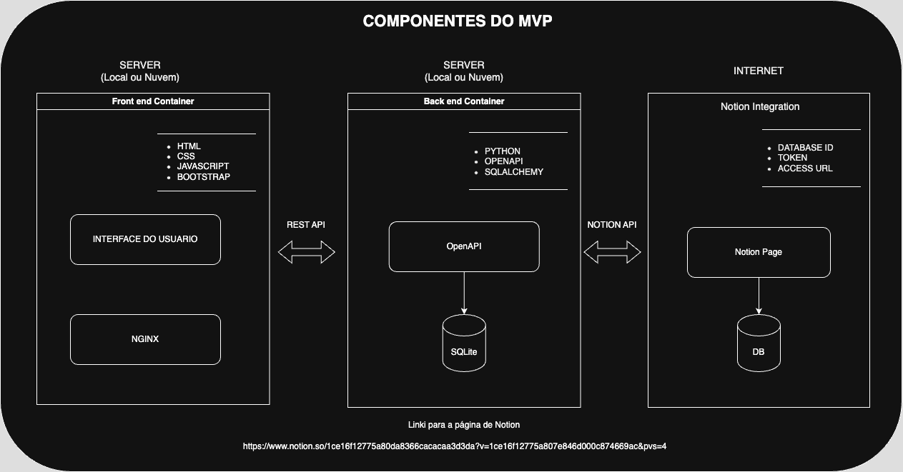
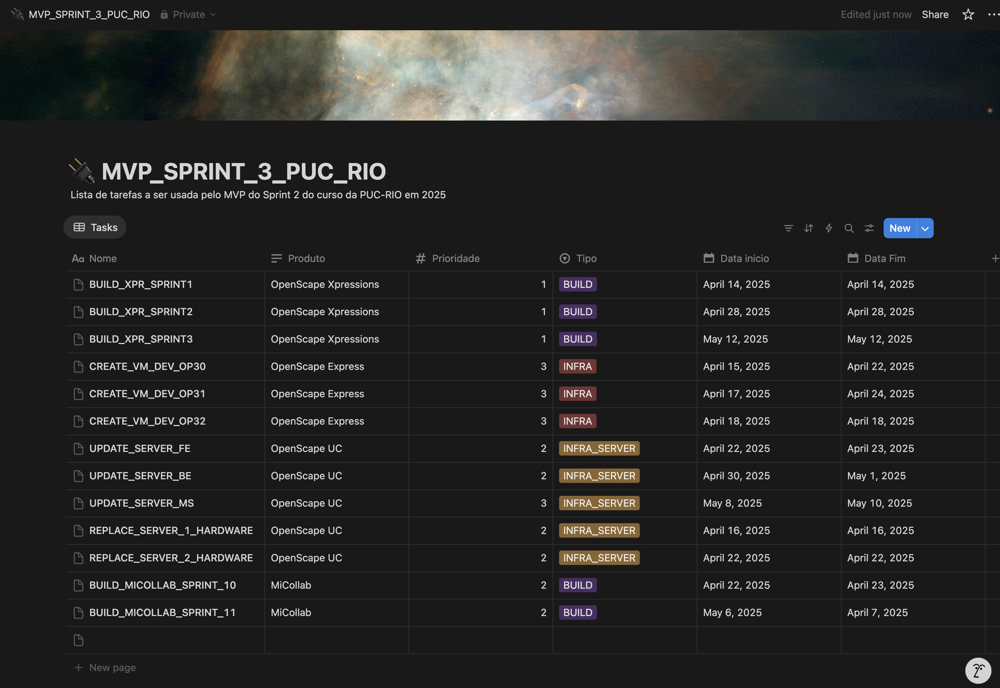

# Production Automation Tool Front-End
**Aluno: Jaquinei de Oliveira**

Este projeto faz parte do *MVP* da *Sprint 2* da Disciplina **Desenvolvimento Back-End Avançado**.

O objetivo é apresentar o resultado prático obtido após o estudo do conteúdo apresentado ao longo das aulas da disciplinas apresentadas durante este Sprint.

O MVP consiste em um Front-End, um Back-End e o acesso a uma API externa.

Este repositorio faz parte do MVP e contem o código para o Front-End.

Dentro os cenários apresentados no documento com as instruções sobre os requisitos para o MVP, esse trabalho está enquadrado no Cenário 1.1, uma vez que o acesso a API externa está sendo realizado pelo Back-End.

O Front-End disponibilizado neste repositório contem o docker file e o docker compose, possibilitando rodar containerizado. 

As instruções para fazer o build da imagem e rodar os container estão na seção [Como iniciar o Front-End usando o Docker Compose](#como-iniciar-o-frontend-usando-o-docker)

**Este README foca nos detalhes de setup e uso do projeto do Front-End.** Para detalhes sobre o projeto do Back-End, acesse o repositório https://github.com/Jaquinei/mvp_2_puc_rio_backend

## Diagrama

Arquitetura implementada.



## Front-End (Interface)

O Front-End foi desenvolvido usando *HTML*, *CSS* e *JavaScript* e *Bootstrap*. Pode ser usado independentemente do Back-End, mas para persistir os dados é necessário que o Back-End esteja rodando.

O Front-End utiliza uma *REST API* (disponibilizada pelo Back-End) para popular e atualizar o banco de dados contido no Back-End. Através da *REST API*, é possível acessar dados que foram populados uma pagina do Notion. O Back-End utiliza a API do Notion para obter os dados e disponibilizá-los para o Front-End.

A interface permite o cadastro de tarefas para serem executadas pelo time de *DevOps* da empresa. Tarefas preenchidas por terceiros em uma página Notion, podem ser tratadas por esse sistema, conforme o time assin o deseje.

### Notion page
Abaixo a pagina do Notion de onde serão extraidas as informações de terafas a serem tratadas pelo time de DevOps.




### Como iniciar o Front-End usando o Docker Compose:

- Certifique-se que o Docker e o Docker Compose estejam instalados
-  Faça o build das imagens
```
`docker-compose build`
```
- Inicie os containers
```
`docker-compose up `
```
- Acesse a URL http://localhost:8080 no navegador


### Como iniciar o Front-End usando o Docker:

- É possivel fazer o build da imagem de cada repositorio individualmente usando apenas docker. Caso tenha interesse, siga os passos a seguir.
Certifique-se que o Docker esteja instalados
- Cria a imagem
```
`docker build -t frontend_puc_rio_sprint_2_mvp .`
```
- Mapeia a porta local 8080 do host para a porta 80 do container
```
`docker run -d -p 8080:80 frontend_puc_rio_sprint_2_mvp`
```
- Acesse a URL http://localhost:8080 no navegador

# Visão geral dos módulos do MVP

## Front-End (Interface)

O código do Front-End está disponível neste repositório. Detalhes estão apresentados na secão [Front-End (Interface)](#frontend-interface)

## Backend (API)

O código do Back-End está disponível em outro repositório. Foi feito usando Python: flask como servidor web e sqlite como banco de dados. 
Uma REST API é disponibilizada através do Back-End para uso pelo Front-End. Detalhes sobre as rotas estão diponíveis no respositório Back-End. O Back-End utiliza a API do Notion para obter os dados e disponibilizá-los para o Front-End.

## Acesso a uma API externa

O acesso a API externa está sendo feito utilizando a API do Notion (https://developers.notion.com/)
Para o backend acessar a API é necessário utilizar as seguintes informações:
- Notion API URL
- Token Notion
- Database ID

Estas informações (*Notion API URL*, *Token e Database ID*) serão disponibilizadas no texto de submissão deste MVP.
Para executar o Docker Compose, as informações deverão ser adiconadas na seção environment do arquivo. Será necessário preencher os campos *API_EXTERNA_DATABASE_ID* e *API_EXTERNA_TOKEN* para possibilitar a conexão com o Notion.

Exemplo do Docker-Compose:
```
    environment:
        - API_EXTERNA_DATABASE_ID=xxxxxx
        - API_EXTERNA_TOKEN=yyyyyy
```
(substitua o texto xxxxxx com o *Databse ID* fornecido no texto da submissão do MVP e o yyyyyy com o *Token Notion* forneciso no texto da submissão do MVP)

Foi criada um Notion page com uma lista de Tasks. Essas tasks podem ser incluidas no Prodution Automation Tool através do botão na Interface *"Get task from an external API (Notion)"*. 
Para acessar a lista do Notion, diretamente, o seguinte link pode ser usado (https://www.notion.so/1ce16f12775a80da8366cacacaa3d3da?v=1ce16f12775a807e846d000c874669ac&pvs=4).

# Development environment - Annotations
Somente para desenvolvimento e troubleshooting. Não é necessário para a avaliação do MVP.

## Como executar o Front-End

### Dev

Faça clone do projeto

Opção 01:
 - abra o arquivo *index.html* no seu browser (idealmente inicie o Back-End usando as instruções do *README* disponível no repositório do Back-End)

Opção 02:
-  após iniciar o container, acesse a URL http://localhost:8080

### Docker

- Cria a imagem
- `docker build -t frontend_puc_rio_sprint_2_mvp .`
- Mapeia a porta local 8080 do host para a porta 80 do container
- `docker run -d -p 8080:80 frontend_puc_rio_sprint_2_mvp`
- Acesse a URL http://localhost:8080 no navegador
